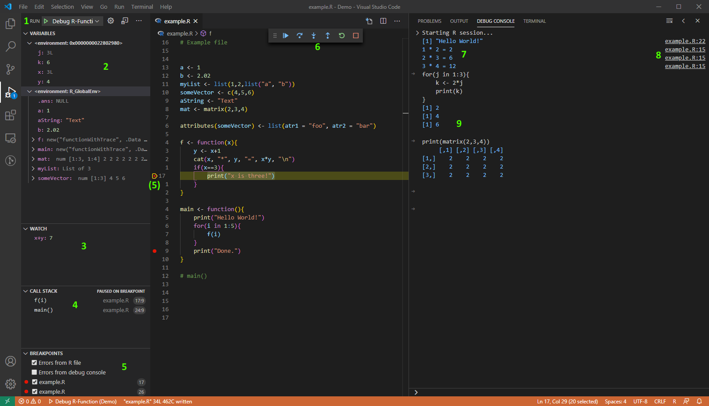

# R Debugger

This extension adds debugging capabilities for the
[R](https://www.r-project.org/)
programming language to Visual Studio Code
and depends on the R package [vscDebugger](https://github.com/ManuelHentschel/vscDebugger).
For further R support in VS Code see e.g. [vscode-R](https://github.com/Ikuyadeu/vscode-R) and [R LSP](https://github.com/REditorSupport/vscode-r-lsp).

## Features



The debugger includes the following features:
1. Run and debug R Code by launching a new R process or attaching to a running one.
2. View scopes and variables of the currently selected stack frame.
For many variables it is also possible to assign a new value to the variable or individual entries/attributes in this view.
3. Add watch expressions that are evaluated in the selected stack frame on each breakpoint/step.
4. View and browse through the call stack when execution is paused.
5. Set breakpoints and break on errors.
6. Control the program flow using *step*, *step in*, *step out*, *continue*.
7. Output generated by the program is printed to the debug console (filtering out text printed by the browser itself).
8. The debugger adds a modified version of `print`, `cat`, `message`, and `str` that also print a link to the file and line where the text was printed.
9. The debug console allows the execution of arbitrary R code in the currently selected stack frame.


## Installation
The latest "stable" version of the VS Code extension can be installed from the
[marketplace](https://marketplace.visualstudio.com/items?itemName=RDebugger.r-debugger).
After installing the extension, the R package can be installed using the command 
`rdebugger.updateRPackage`.
If this does not work, you can find the source code and compiled binaries on the
[releases site](https://github.com/ManuelHentschel/VSCode-R-Debugger/releases).

The provided packages were built using R 4.0.2 and might be incompatible with older R versions.
In these cases it is necessary to build the package from code.

If you want to install a development version, the VS Code extension can be installed from the .vsix-files found 
[here](https://github.com/ManuelHentschel/VSCode-R-Debugger/actions?query=workflow%3Amain).
To download the correct file, filter the commits by branch, select the latest commit,
and download the file `r-debugger.vsix` under the caption "Artifacts".
To install the latest development version of the required R-package from GitHub, run
`devtools::install_github("ManuelHentschel/vscDebugger")`
or install from the artifacts found 
[here](https://github.com/ManuelHentschel/vscDebugger/actions).

If your R path is neither in the Windows registry nor the `PATH` environment variable, make sure to provide a valid path to the R executable in `rdebugger.rterm.*`.

**Note on the package version:**
Since the debugger is still under initial development, both this extension and the accompanying R package are major version 0.y.z.
The minor version (x.Y.z) is incremented when backward incompatible changes to the interface/communication between the VS Code extension and the R package are introduced.
Compatibility between the two is only intended ("guaranteed") if both have the same minor version.
The patch version (x.y.Z) is incremented independently for all other changes that justify a new release.


## Using the Debugger
### Launch Mode
* Press F5 and select `R Debugger` as debugger. With the default launch configuration, the debugger will start a new R session.
* To run a file, focus the file in the editor and press F5 (or the continue button in the debug controls)
* Output will be printed to the debug console,
expressions entered into the debug console are evaluated in the currently active frame
* During debugging in the global workspace it is often necessary to click the dummy frame
in the callstack labelled 'Global Workspace' to see the variables in `.GlobalEnv`.

### Attach Mode
* Start R in a terminal
* Load `library(vscDebugger)`
* Call `.vsc.listen()`
* Start the debugger with launch configuration including `"request":"attach"`, e.g.:
``` json
{
    "type": "R-Debugger",
    "request": "attach",
    "name": "Attach to R process"
}
```

## Configuration
For a detailed explanation of possible launch config entries and other settings, see
[configuration.md](./configuration.md) on github.

## How it works
The debugger works as follows:
* An R process is started inside a child process
* The R package `vscDebugger` is loaded.
* The Debugger starts and controls R programs by sending input to stdin of the child process
* After each step, function call etc., the debugger calls functions from the package `vscDebugger` to get info about the stack/variables

The output of the R process is read and parsed as follows:
* Information sent by functions from `vscDebugger` is encoded as json and sent via a TCP socket.
These lines are parsed by the VS Code extension and not shown to the user.
* Information printed by the `browser()` function is parsed and used to update the source file/line highlighted inside VS Code.
These lines are also hidden from the user.
* Everything else is printed to the debug console


## Debugging R Packages
In general, R packages can also be debugged using this extension.
For this to work, the proper source information must be retained during the installation of the package
(check `attr(attr(FUNCTION_NAME, 'srcref'), 'srcfile')` for some function from the package):
* The package must be installed from source code (not CRAN or `.tar.gz`)
* The flag `--with-keep.source` should be set
* Extensions containing C code seem to cause problems sometimes.
Sometimes it helps to install the package using
`devtools::install(quick=FALSE, ...)`
to compile the binaries and again with
`devtools::install(quick=TRUE, ...)`
to retain the source information.

The packages that are being debugged need to be specified in the launch config as follows:
```json
"debuggedPackages": ["MyPackage"],
...
```

To overwrite the `print`/`cat`/`message` functions for an individual package,
they need to be explicitly assigned somewhere in the package:
``` r
print <- print
cat <- cat
message <- message
```
This assignment can be overwritten by the debugger with
`.vsc.print`/`.vsc.cat`/`.vsc.message`, but has no effect when not using the debugger.

## Warning
In the following cases the debugger might not work correctly/as expected:
* Calls to `trace()`, `tracingstate()`:
These are used to implement breakpoints, so usage might interfere with the debugger's breakpoints
* Custom `options(error=...)`: the debugger uses its own `options(error=...)` to show stack trace etc. on error
* Any form of (interactive) user input in the terminal during runtime (e.g. `readline(stdin())`), since
the debugger passes all user input through `eval(...)`.
* Code that contains calls to `sys.calls()`, `sys.frames()`, `attr(..., 'srcref')` etc.:
Since pretty much all code is evaluated through calls to `eval(...)` these results might be wrong. <!-- If required, input in the debug console can be sent directly to R's `stdin` by prepending `###stdin`. -->
* Extensive use of graphical output/input, stdio-redirecting, `sink()`
* Extensive use of lazy evaluation, promises, side-effects:
In the general case, the debugger recognizes unevaluated promises and preserves them.
It might be possible, however, that the gathering of information about the stack/variables leads to unexpected side-effects.
Especially watch-expressions must be safe to be evaluated in any frame,
since these are passed to `eval()` in the currently viewed frame any time the debugger hits a breakpoint or steps through the code.

## Contributing
This package is still under development.
If you have problems, suggestions, bug fixes etc. feel free to open an
[issue](https://github.com/ManuelHentschel/VSCode-R-Debugger/issues)
or submit a pull request.
Any feedback or support is appreciated!
Special thanks to
[@tdeenes](https://github.com/tdeenes)
for providing the C code used in the R package, and
[@renkun-ken](https://github.com/renkun-ken)
for his numerous contributions and feedback!
